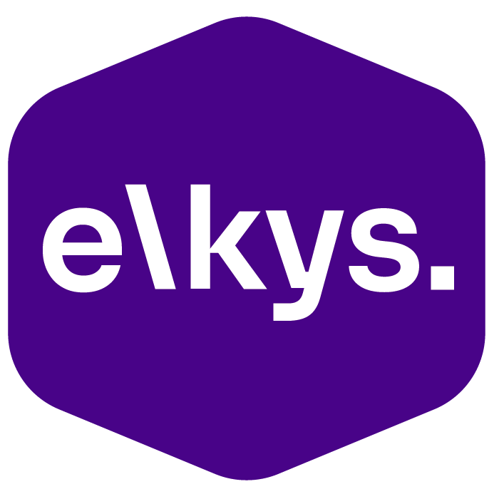

<div align="center">



# giga-conta

**Easy Budget: gestao financeira pessoal e empresarial, React + Vite (gerado no Lovable).**

Repositório legado da Elkys, mantido só como histórico.<br/>Sem manutenção, sem deploy e sem garantia de funcionar como está.

[](#estado)
[](#stack)
[](#estado)

[O que é](#o-que-é) · [Estado](#estado) · [Stack](#stack) · [Rodar](#rodar-localmente) · [Layout](#layout-do-repositório)

</div>

---

## O que é

Easy Budget: gestao financeira pessoal e empresarial, React + Vite (gerado no Lovable); legado

## Estado

| Item | Situação |
| --- | --- |
| Manutenção | nenhuma; o repositório fica como referência |
| Último trabalho no código | 2025-12-03 |
| CI | só o `seguranca-e-qualidade.yml` gerado pelo robô do [ci-templates](https://github.com/ElkysOfficial/ci-templates) |
| Proteção | ruleset da organização: PR obrigatório na branch padrão, sem force-push |

Para reativar, comece por um projeto novo com `sdk-elkys create` e traga só o que ainda serve.

## Stack

React · Vite · TypeScript · Tailwind CSS

## Rodar localmente

```bash
npm install
npm run dev
npm run build
```

Segredos e variáveis, quando existem, ficam em `.env` (nunca versionado); procure um `.env.example`.

## Layout do repositório

```
README.md
bun.lockb
components.json
eslint.config.js
index.html
package-lock.json
package.json
postcss.config.js
public/
src/
tailwind.config.ts
tsconfig.app.json
tsconfig.json
tsconfig.node.json
vite.config.ts
```
